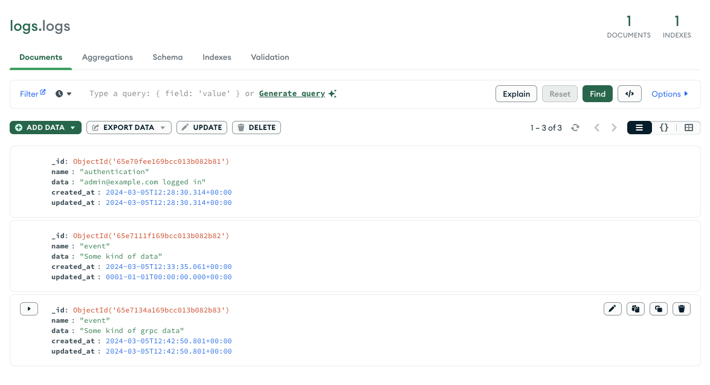

# Go Mircoservices - Application

Hello, below in the README file is the current state of the application based on microservices architecture. Currently the application has 9 services:

### Front-end Service

It was created to visualize communication between microservices. A simple layout with sections corresponding to the following.
- Information what service we are testing
- What we are sending
- What we are receiving


### Broker Service

In this service we have routers that are responsible for communication via the REST API with other services, at the moment the service broker's communication with the front-end is tested. Broker in this case it is acting as a client. The service contacts other services, which is informed by the message sent. The services to which requests are sent inform us in the feedback in the "Received" section.

### Authentication Service

The Authentication service is currently responsible for authorising future users. The current image is integrated into a Postgresql database, the image of which, as well as the other services, can be found in docker compose. After pressing the "Test Auth" button, we send the information to the service where the database was created in order to log in. The authentication information is logged in the Mongo database which is used in the Logger Service


### Logger Service

The service uses a NoSQL database to extract all the information that is retrieved from activities between services. In its current state, the service logger uses communications via the RPC protocol


### Mail Service

Mail service uses docker image located in a publicly available repository. The service uses the "MailHog" image to visualize and use the mail service. After pressing the "Test Mail" button, a test mail is sent and after a while we can see it on another port ":8025"


### Listener Service

The service uses RabbitMQ queuing to capture various types of information that services send.

### gRPC Communication

In the latest version, the application communicates using gRPC. The protocol is currently implemented for Logger service communication. After pressing the "Test gRPC" button, we test the communication and the correctness of the logs in MongoDB




### Legacy

- Deploying App using Docker Swarm
- Deploying App to Kubernetes
- Testing Microservices


# Building Application

To build or start application we have to be in ```project``` dir. There we have ```Makefile``` We can use command such as.
For the first time ```make up_build``` it will build images with current services that are available inside project. Run ```make start``` To start front-end. In case of stopping services we can use ```make down``` and ```make stop```